# Ukraine Air Alert Time Series Analysis

## Overview

This project performs comprehensive time series analysis of air raid alerts across major Ukrainian cities. The analysis covers data from March 2022 through June 2026, examining temporal patterns, seasonal effects, and forecasting models.

## Project Structure

```
air-raid-alerts-analysis/
├── data/                    # Raw and processed data
├── notebooks/               # Jupyter notebooks for analysis
├── src/                     # Python source code
│   ├── data_collection.py   # Data loading and API access
│   ├── data_cleaning.py     # Data preprocessing and cleaning
│   ├── analysis.py          # Statistical analysis functions
│   ├── forecasting.py       # Time series forecasting models
│   ├── visualization.py     # Plotting functions
│   └── main.py              # Main orchestration script
├── images/                  # Generated plots
├── output/                  # Analysis results
└── requirements.txt         # Python dependencies
```

## Cities Analyzed

| City | Oblast | Threat Level | Rationale |
|------|--------|--------------|-----------|
| **Kyiv** | Kyivska | 🟡 Medium | Capital, symbolic target, long-range strikes |
| **Kharkiv** | Kharkivska | 🔴 Extreme | 2nd largest city, ~30km from Russian border |
| **Lviv** | Lvivska | 🟢 Low | Western rear, lowest-threat baseline |
| **Dnipro** | Dnipropetrovska | 🟠 High | Strategic industrial hub, rear city |
| **Zaporizhzhia** | Zaporizka | 🟠 High | South, adjacent to occupied territory |
| **Uzhhorod** | Zakarpatska | 🟢 Low | Westernmost city, lowest threat baseline |
| **Sumy** | Sumska | 🟠 High | Border region, partially occupied |
| **Chernihiv** | Chernihivska | 🟡 Medium | Belarus border, drone corridor |

### Why These Cities?

1. **Maximum contrast**: Kharkiv (extreme) vs Uzhhorod/Lviv (low) — significant difference
2. **Geographic coverage**: East (Kharkiv) → North (Sumy, Chernihiv) → Center (Kyiv, Dnipro) → South (Zaporizhzhia) → West (Lviv, Uzhhorod)
3. **Data quality**: 34.9%–99.7% coverage across all regions
4. **Strategic significance**: Each region represents a distinct threat vector

## Key Metrics

1. **Total Alert Duration per Day** (minutes) - primary metric for threat intensity
2. **Alert Count** - number of separate alert events
3. **Night Share** - proportion of alert time during night hours (23:00-06:00)
4. **Time Buckets** - Night (23:00-06:00), Morning (06:00-12:00), Afternoon (12:00-18:00), Evening (18:00-23:00)

## Installation

```bash
pip install -r requirements.txt
```

## Usage

### Run Full Analysis

```bash
cd src
python main.py
```

### Run Jupyter Notebook

```bash
cd notebooks
jupyter notebook analysis.ipynb
```

## Data Sources

- **Primary**: Raw CSV data from air raid alert systems
- **Fallback**: Ukraine Alarm API (requires API key)

## Key Findings

### Daily Alert Duration by City

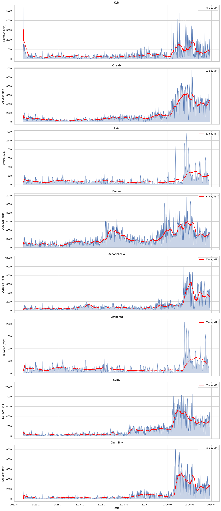

A clear threat gradient emerges. **Donetsk** shows sustained high-intensity alerts throughout the period, while **Uzhhorod** maintains consistently low levels. **Sumy** and **Chernihiv** occupy the middle ground, with Sumy showing escalation from 2025 onward.

### Time-of-Day Breakdown

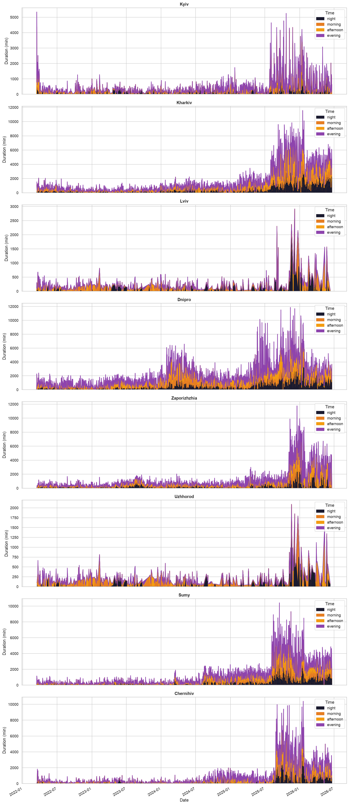

Donetsk shows intense 24-hour alert activity, while Uzhhorod's alerts cluster in specific time windows. Chernihiv's pattern reflects drone corridor dynamics from Belarus.

### Night Share Analysis

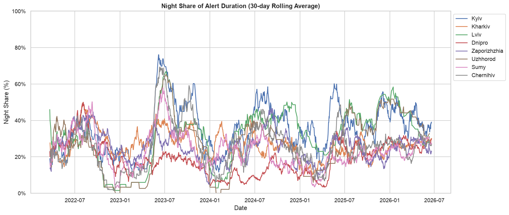

Night share varies significantly across the threat gradient. Donetsk maintains consistent night activity, while Uzhhorod shows more sporadic night alerts.

### Monthly Heatmaps

| Kyiv | Kharkiv |
|------|---------|
| 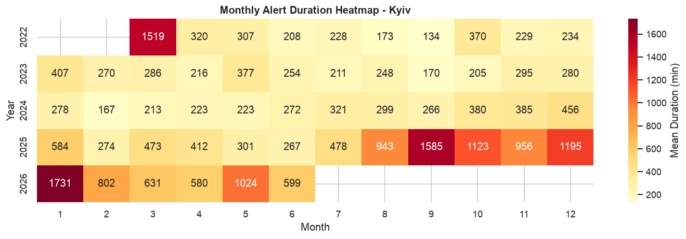 | 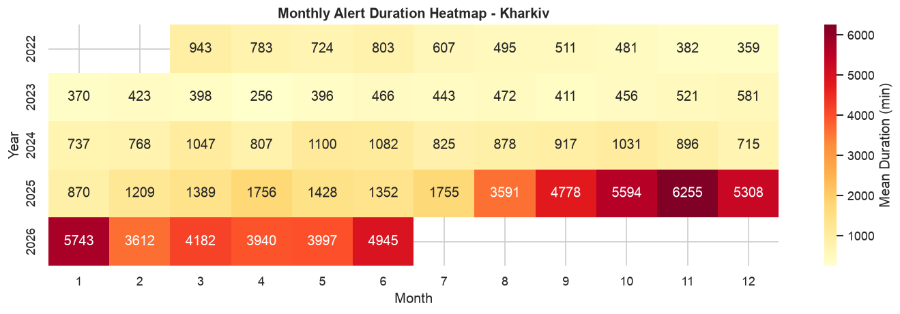 |

| Lviv | Dnipro |
|------|--------|
| 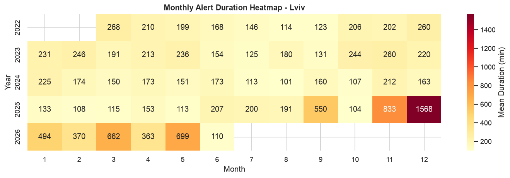 | 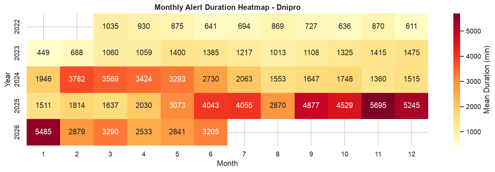 |

| Zaporizhzhia | Uzhhorod |
|--------------|----------|
| 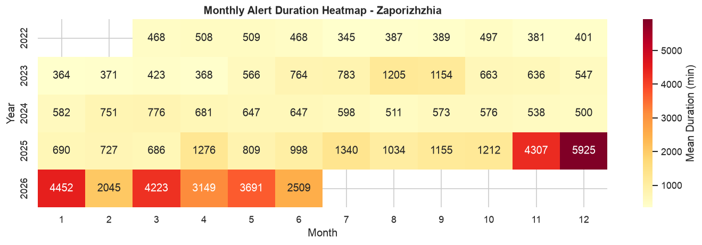 | 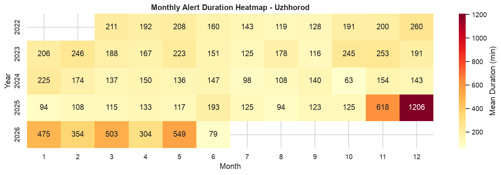 |

| Sumy | Chernihiv |
|------|-----------|
| 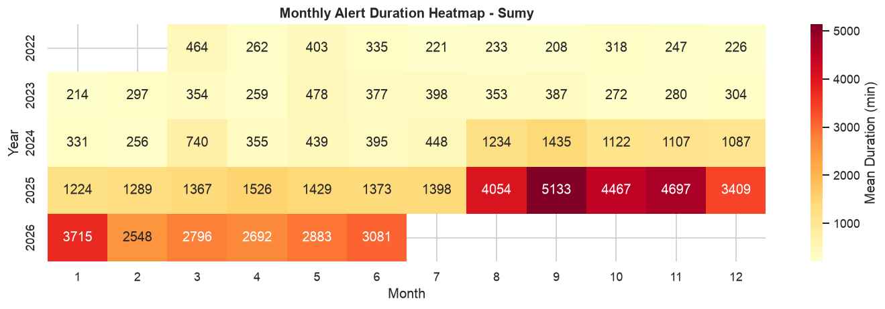 | 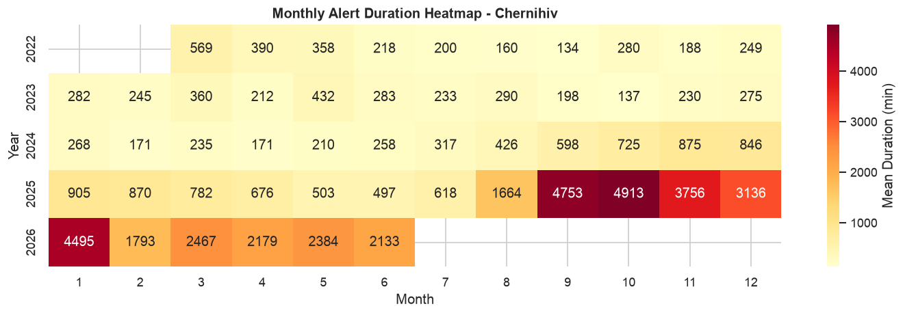 |

### Structural Patterns
- Kharkiv shows sustained high-intensity alerts throughout the period
- Sumy escalation from 2025 onward correlates with increased border activity
- Chernihiv's pattern reflects drone corridor dynamics from Belarus
- Uzhhorod and Lviv maintain lowest threat levels, serving as baseline reference
- Kyiv shows moderate threat levels with periodic escalations
- Dnipro and Zaporizhzhia show high-intensity alerts

### Data Quality
- Kyiv: 74.8% coverage (1,165 days)
- Kharkiv: 98.7% coverage (1,536 days)
- Lviv: 36.6% coverage (567 days)
- Dnipro: 99.7% coverage (1,553 days)
- Zaporizhzhia: 99.5% coverage (1,548 days)
- Uzhhorod: 34.9% coverage (540 days)
- Sumy: 94.6% coverage (1,473 days)
- Chernihiv: 84.2% coverage (1,311 days)

## Forecasting Models

| Model | Description |
|-------|-------------|
| **ARIMA** | Auto-regressive integrated moving average — captures linear trends |
| **Holt-Winters** | Exponential smoothing with trend and seasonality components |
| **Prophet** | Facebook's additive model — handles changepoints and holidays |

### Model Comparison (30-day test set)

| City | Best Model | MAPE (%) | R² |
|------|------------|----------|-----|
| Kyiv | ARIMA(1,1,1) | 175.9 | -0.011 |
| Kharkiv | ARIMA(1,1,1) | 24.1 | -0.798 |
| Lviv | Holt-Winters | 63.1 | -0.081 |
| Dnipro | ARIMA(1,1,1) | 26.2 | -0.105 |
| Zaporizhzhia | ARIMA(1,1,1) | 251.0 | -0.011 |
| Uzhhorod | Prophet | 56.1 | -0.026 |
| Sumy | ARIMA(1,1,1) | 30.0 | -0.231 |
| Chernihiv | ARIMA(1,1,1) | 48.9 | -0.008 |

> **Note:** Negative R² values indicate that the models struggle to outperform a naive mean forecast. This is expected given the unpredictable, event-driven nature of air raid alerts — structural breaks from war escalation make traditional time series forecasting inherently limited.

## License

This project is for educational and research purposes.
